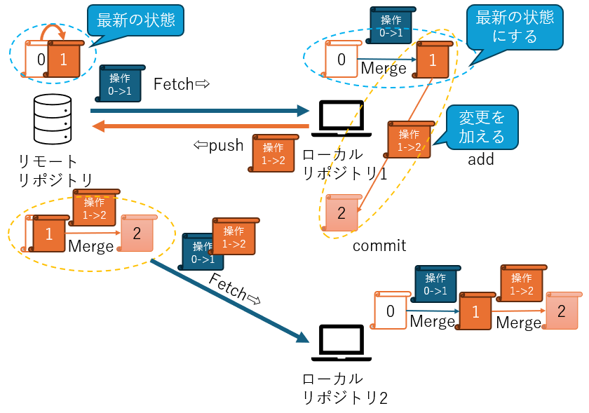

# GitとGitHub入門

## Gitとは

Gitは、分散型バージョン管理システムであり、ファイルの変更履歴を管理し、複数人での作業を効率的に進めるためのツールである。  
ローカル環境での管理が基本で、リポジトリをリモートからローカルに取り込み(フェッチ)変更を加え(コミット)リモートへ変更を反映させる(プッシュ)。

## GitHubとは

GitHubは、Gitリポジトリをホスティングするためのクラウドサービスであり、Gitを使ってローカルで管理しているプロジェクトをオンラインで共有し、共同開発を容易にしてくれる。

## 語句解説

|語句      |意味                                    |
|--        |--                                      |
|リポジトリ|データの保存場所                        |
|ローカル  |自分の機器、環境                        |
|リモート  |離れた場所の機器、環境                  |
|フェッチ  |リモートの最新の変更を読み出す          |
|マージ    |読み出した変更をローカルに適用する(併合)|
|ステージ  |コミットにより変更が確定されるエリア    |
|コミット  |ステージされた変更を確定させる          |
|プッシュ  |変更をリモートに送る                    |

## 主なGitコマンドとその動作

### 基本的な流れ(gitとgithubを利用)




### 1. `git pull`

リモートリポジトリから最新の変更を取得し、ローカルのブランチにマージ。

- **動作詳細**:
  1. リモートリポジトリから最新の変更を取得（`fetch`）。
  2. 取得した変更を現在のブランチにマージ（`merge`）。

- **使い方**:

  ```bash
  git pull origin main
  ```
  
  `origin` はリモートリポジトリの名前、`main` は対象のブランチ。

---

### 2. `git push`

ローカルリポジトリの変更をリモートリポジトリに反映。

- **動作詳細**:
  1. ローカルの変更をリモートにアップロード。
  2. リモートのブランチを更新。

- **使い方**:
  ```bash
  git push origin main
  ```

---

### 3. `git fetch`
リモートリポジトリから最新の変更を取得するが、ローカルの作業ブランチには反映しない。

- **動作詳細**:
  1. リモートリポジトリの最新情報を取得。
  2. ローカルリポジトリに情報を保存するが、作業ブランチは変更しない。

- **使い方**:
  ```bash
  git fetch origin
  ```

---

### 4. `git merge`
他のブランチの変更を現在のブランチに統合。

- **動作詳細**:
  1. マージ対象のブランチの変更を取得。
  2. コンフリクト（競合）がある場合、手動で解決が必要。

- **使い方**:
  ```bash
  git merge feature-branch
  ```

---

### 5. `git add`
変更したファイルをステージングエリアに追加。

- **動作詳細**:
  1. ファイルを次回のコミット対象としてマーク。

- **使い方**:
  ```bash
  git add filename
  ```

  または、すべての変更を追加する：
  ```bash
  git add .
  ```

---

### 6. `git commit`
ステージングエリアの内容をローカルリポジトリに保存。

- **動作詳細**:
  1. スナップショットを作成し、履歴として保存。

- **使い方**:
  ```bash
  git commit -m "コミットメッセージ"
  ```

---

### 7. `git clone`
リモートリポジトリをローカルにコピー。

- **動作詳細**:
  1. リモートリポジトリの内容を取得。
  2. ローカル環境にリポジトリを作成。

- **使い方**:
  ```bash
  git clone https://github.com/username/repository.git
  ```

---

### 8. `git branch`
ブランチの作成、一覧表示、削除を行う。

- **動作詳細**:
  1. ブランチの作成、切り替え、削除が可能。

- **使い方**:
  - ブランチ一覧の表示:
    ```bash
    git branch
    ```
  - 新しいブランチの作成:
    ```bash
    git branch new-branch
    ```
  - ブランチの削除:
    ```bash
    git branch -d branch-name
    ```

---

### 9. `git checkout`
特定のブランチやコミットに切り替える。

- **動作詳細**:
  1. 現在の作業ブランチを指定したブランチやコミットに切り替え。

- **使い方**:
  ```bash
  git checkout branch-name
  ```

---

### 10. `git status`
現在のリポジトリの状態を表示。

- **動作詳細**:
  1. 変更されたファイルや、ステージングされているファイルを確認。

- **使い方**:
  ```bash
  git status
  ```

---

### 11. `git log`
コミット履歴を表示。

- **動作詳細**:
  1. 過去のコミット情報を一覧で確認可能。

- **使い方**:
  ```bash
  git log
  ```

---

# GitとGitHubの使用例

以下では、GitとGitHubを活用する例を示す

1. **リポジトリの初期化**:
    ```bash
    git init
    ```

2. **ファイルの追加とコミット**:
    ```bash
    git add .
    git commit -m "初回コミット"
    ```

3. **リモートリポジトリの設定**:
    ```bash
    git remote add origin https://github.com/username/repository.git
    ```

4. **初回プッシュ**:
    ```bash
    git push -u origin main
    ```

5. **変更をリモートから取得**:
    ```bash
    git pull origin main
    ```
